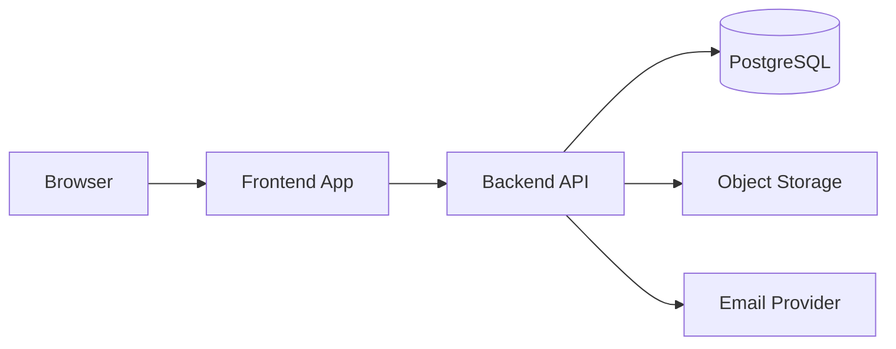

# Architecture

> **Status:** Proposed — not implemented. Stack choices are **Needs Decision**.

## Overall Architecture

**Planned pattern:** Modular monolith or small full-stack app with separate frontend and API layers.

Suitable for MVP scale. Split into microservices only if proven necessary later.

## Frontend Framework

**Needs Decision.** Common options:

| Option | Pros | Cons |
|--------|------|------|
| Next.js (App Router) | Full-stack, SSR, large ecosystem | Opinionated structure |
| React + Vite SPA | Simple SPA | Separate API hosting |
| Nuxt / Vue | If team prefers Vue | Smaller default ecosystem |

**Recommendation (provisional):** Next.js or React + Vite if team is React-comfortable — **not accepted yet**.

## Backend Framework

**Needs Decision.** Options:

| Option | Notes |
|--------|-------|
| Next.js API routes | Co-located with frontend |
| NestJS | Structured modules, good for growth |
| Express / Fastify | Minimal, flexible |
| tRPC | End-to-end types with TypeScript frontend |

If Next.js full-stack is chosen, API routes or Route Handlers may replace separate backend service for MVP.

## Database

**Proposed:** PostgreSQL — relational data fits projects, tasks, memberships.

**ORM (Needs Decision):** Prisma, Drizzle, or TypeORM.

**Status:** Planned

## Authentication Method

**Needs Decision.** Options:

- JWT in HTTP-only cookies (recommended for web)
- Session store (Redis) with cookie session ID
- OAuth only (unlikely for MVP)

See `AUTH_RBAC.md`.

## Authorization / RBAC

Per-project membership with roles (owner, editor, viewer). Enforced in API layer and reflected in UI.

**Status:** Planned

## API Communication

**Proposed:** REST JSON for MVP simplicity.

GraphQL or tRPC optional if team prefers type safety end-to-end.

**Status:** Planned — see `API_CONTRACTS.md`

## File Storage

**Proposed:** S3-compatible object storage (AWS S3, Cloudflare R2, etc.)

- Private buckets
- Signed URLs for upload/download
- Metadata in PostgreSQL

**Status:** Planned

## Queues / Background Jobs

**Deferred for MVP.** Add queue (BullMQ, Inngest, etc.) when email/notifications require async processing.

## Deployment Structure

**Needs Decision.** Options:

| Target | Notes |
|--------|-------|
| Vercel + managed Postgres | Fast for Next.js |
| Railway / Render | Full-stack friendly |
| Docker on VPS | More ops overhead |

See `DEPLOYMENT.md`.

## Major Constraints

- Documentation-first until requirements confirmed
- No microservices for MVP
- Security: auth and file upload must be reviewed before production

## Reasoning

Start simple: one deployable app, one database, clear module boundaries in code so extraction later is possible without premature distributed complexity.
