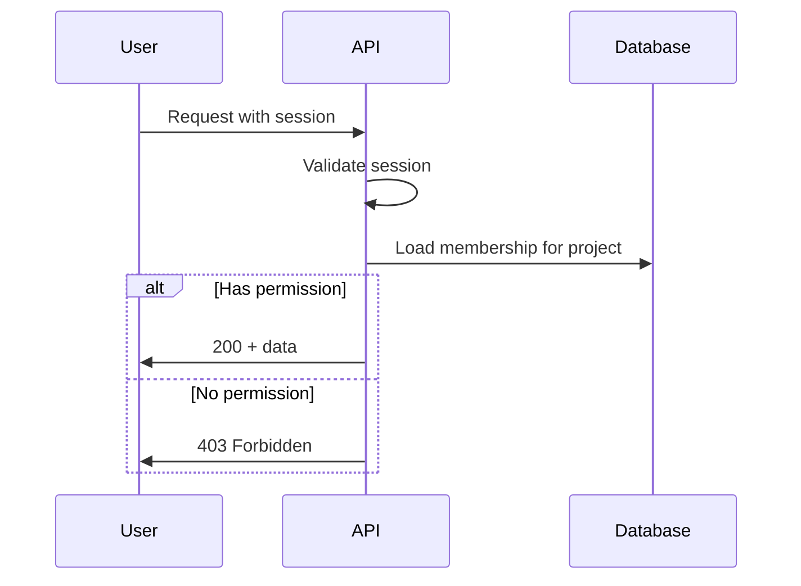

# Authentication and RBAC

> **Status:** Planned

## Authentication

### Planned Approach

- Email + password for MVP
- Passwords hashed with bcrypt or argon2
- Session via HTTP-only, Secure, SameSite cookies **or** short-lived JWT + refresh (Needs Decision)

### Public Routes (Planned)

- `/login`
- `/register`
- `/` (marketing — if exists)
- `POST /api/auth/register`
- `POST /api/auth/login`

### Private Routes (Planned)

- Dashboard and all project routes
- All `/api/*` except auth register/login

## Authorization Model

### Global Roles (Optional)

| Role | Scope |
|------|-------|
| `user` | Default registered user |
| `admin` | Platform administration |

**Status:** `admin` only if SaaS — Needs Decision

### Project-Scoped Roles (Recommended)

| Role | Permissions (draft) |
|------|---------------------|
| `owner` | Full project control, delete project, manage members |
| `editor` | CRUD tasks, upload files, edit project fields |
| `viewer` | Read-only project and tasks |

### Enforcement

1. API middleware validates authentication
2. Service layer checks `project_members` for resource access
3. Frontend hides UI actions user cannot perform (defense in depth)

## RBAC Flow

## Security Notes

- Never expose password hashes
- Rate limit login attempts (Planned)
- CSRF protection if using cookies (Planned)
- Invite tokens single-use and time-limited

See `SECURITY.md`.
