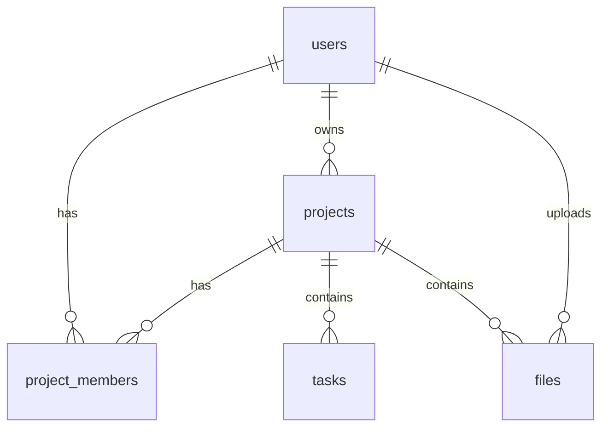

# Database Schema

## Implemented compliance records (2026-07-23)

- `ProjectRequest` stores current consent and the versions/timestamps of communication consent, Terms acceptance, and Privacy acknowledgment.
- `ConsentEvent` is the append-only evidence ledger: action, purpose, channels, normalized subject contacts, exact server-controlled disclosure, document version, source, IP/user-agent evidence, optional project/user link, and timestamp.
- `CommunicationSuppression` is the current do-not-contact state, uniquely keyed by channel plus normalized email/phone.
- `EmailSuppression` remains for SendGrid compatibility; bulk sends check both stores.

The Prisma schema is the source of truth. Corrections append a new event. Privacy deletion may de-identify subject fields while retaining the minimum evidence required to honor a suppression or legal obligation.

> **Status:** Planned — no migrations exist. Schema is a **draft** for discussion.

## Overview

PostgreSQL relational schema for users, projects, tasks, memberships, and files.

## Tables (Planned)

### users

| Column | Type | Notes |
|--------|------|-------|
| id | UUID PK | |
| email | VARCHAR UNIQUE | |
| password_hash | VARCHAR | Nullable if OAuth later |
| name | VARCHAR | |
| created_at | TIMESTAMPTZ | |
| updated_at | TIMESTAMPTZ | |

### projects

| Column | Type | Notes |
|--------|------|-------|
| id | UUID PK | |
| owner_id | UUID FK → users | |
| name | VARCHAR | Required |
| description | TEXT | Optional |
| address | VARCHAR | Optional |
| status | ENUM | e.g. planning, active, completed |
| created_at | TIMESTAMPTZ | |
| updated_at | TIMESTAMPTZ | |

### project_members

| Column | Type | Notes |
|--------|------|-------|
| id | UUID PK | |
| project_id | UUID FK | |
| user_id | UUID FK | |
| role | ENUM | owner, editor, viewer |
| created_at | TIMESTAMPTZ | |

Unique: `(project_id, user_id)`

### tasks

| Column | Type | Notes |
|--------|------|-------|
| id | UUID PK | |
| project_id | UUID FK | |
| title | VARCHAR | |
| status | ENUM | todo, done |
| due_date | DATE | Optional |
| sort_order | INT | Optional |
| created_at | TIMESTAMPTZ | |
| updated_at | TIMESTAMPTZ | |

### files

| Column | Type | Notes |
|--------|------|-------|
| id | UUID PK | |
| project_id | UUID FK | |
| uploaded_by | UUID FK → users | |
| filename | VARCHAR | |
| mime_type | VARCHAR | |
| storage_key | VARCHAR | S3 key |
| size_bytes | BIGINT | |
| created_at | TIMESTAMPTZ | |

### invites (Planned — collaboration phase)

| Column | Type | Notes |
|--------|------|-------|
| id | UUID PK | |
| project_id | UUID FK | |
| email | VARCHAR | |
| role | ENUM | |
| token | VARCHAR UNIQUE | |
| expires_at | TIMESTAMPTZ | |
| accepted_at | TIMESTAMPTZ | Nullable |

## Relationships

## Indexes (Planned)

- `projects(owner_id)`
- `tasks(project_id)`
- `project_members(user_id)`
- `files(project_id)`

## Migration Notes

- Use ORM migrations when stack chosen
- Never run destructive migrations on production without backup

## Seed Data

**None yet.**

When added, document here and in `docs/operations/SETUP.md`.

**Demo Only — Remove or Replace Before Production:** Any seed users/projects must be labeled demo.

## Known Schema Issues

- `project_members` vs owner_id on projects — avoid duplicate ownership rules (document in DECISION_LOG when decided)

## Production Safety

- Use connection pooling in production
- Restrict DB credentials by environment
- Enable backups on managed Postgres
