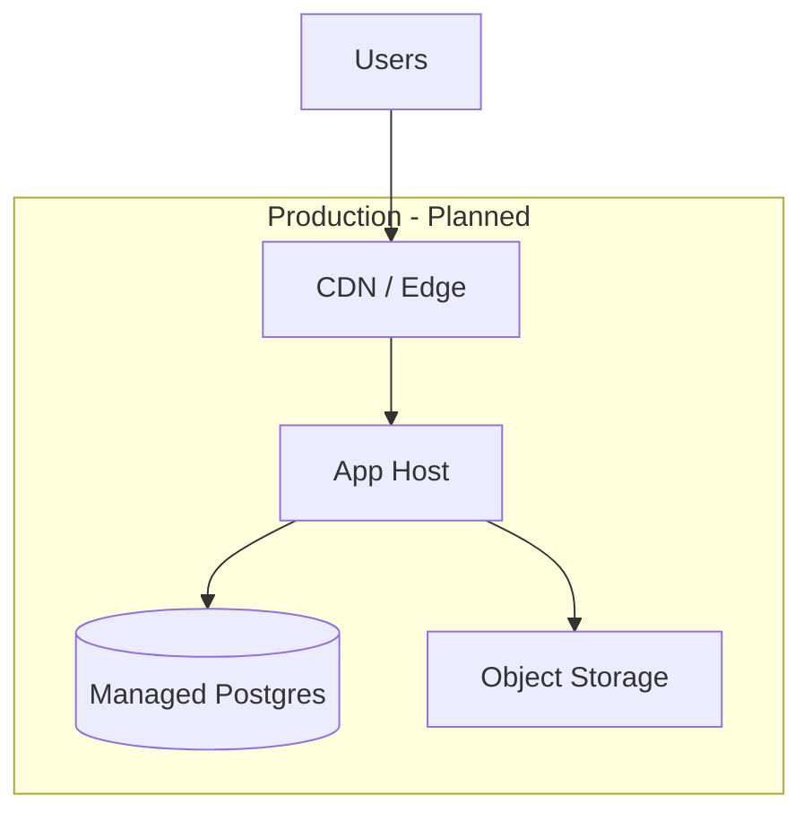

# Deployment Architecture

> **Status:** Planned

## Target Environments

| Environment | Purpose | Status |
|-------------|---------|--------|
| local | Developer machines | Planned |
| staging | Pre-production testing | Planned |
| production | Live users | Planned |

## Planned Topology

## Build Artifacts

**Needs Decision** based on stack:

- Static frontend + Node API
- Or unified Next.js deployment

## Database Migrations

- Run migrations as part of deploy pipeline or release step
- Backup before production migrations

## Secrets Management

- Production secrets in host environment or secret manager
- Never in git

## Rollback Strategy

- Keep previous deployment artifact available
- Database migrations should be backward-compatible when possible

See `docs/operations/DEPLOYMENT.md` for operational checklist.
