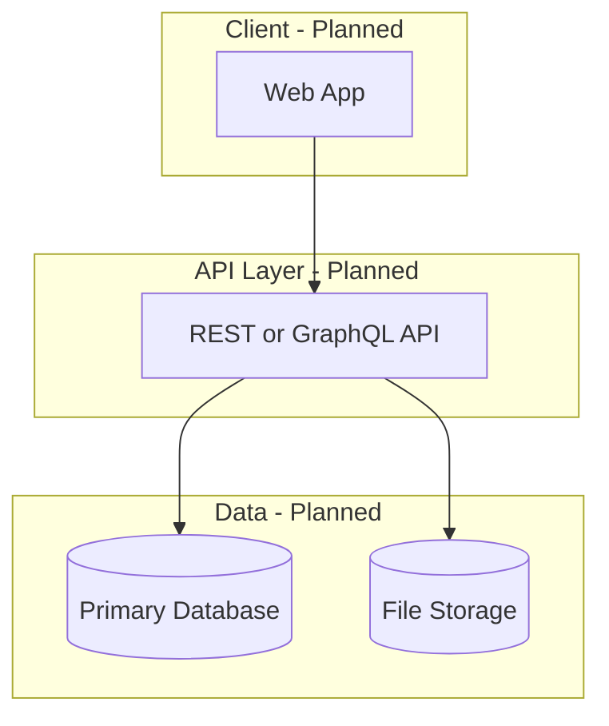

# System Map

> **Project status:** New — structure below is **planned/intended** unless marked **Implemented**.

## High-Level Architecture (Planned)



## Frontend Structure

**Status: Planned**

```txt
/                    # Root — no src/ yet
/docs/frontend/      # UI documentation only
```

Intended (after Phase 1 — **Needs Decision**):

```txt
src/ or app/         # Framework-specific app root
  components/
  pages/ or routes/
  lib/               # API client, utilities
  styles/
```

## Backend Structure

**Status: Planned**

No `server/`, `api/`, or backend package exists yet.

Intended (after Phase 1 — **Needs Decision**):

```txt
src/
  modules/           # Feature modules
  auth/
  projects/
  tasks/
  uploads/
```

## Database Structure

**Status: Planned**

See `docs/architecture/DATABASE_SCHEMA.md`. No migrations or ORM models exist.

## Authentication Flow

**Status: Planned**

1. User registers or logs in
2. Server issues session or token (method TBD)
3. Protected routes require valid auth
4. Role checks on sensitive actions

See `docs/architecture/AUTH_RBAC.md`.

## Authorization / RBAC Flow

**Status: Planned**

- Role assigned per user (global) and/or per project (membership)
- API middleware/guards enforce permissions
- UI hides actions user cannot perform

## External Integrations

**Status: Planned — none selected**

| Integration | Purpose | Status |
|-------------|---------|--------|
| Email (SMTP/SES) | Invites, notifications | Planned |
| Object storage (S3/R2) | File uploads | Planned |
| Payment (Stripe) | Invoicing | Later |
| Maps | Job site location | Later |

## Background Jobs

**Status: Planned**

Possible future jobs:

- Email notifications
- Thumbnail generation for uploads
- Scheduled reminders

No queue infrastructure exists.

## Deployment Flow

**Status: Planned**

1. CI runs lint and tests
2. Build frontend and backend artifacts
3. Deploy to hosting (TBD)
4. Run database migrations

See `docs/architecture/DEPLOYMENT.md` and `docs/operations/DEPLOYMENT.md`.

## Important Directories

| Path | Status | Purpose |
|------|--------|---------|
| `/docs` | Implemented | Project documentation |
| `/docs/context` | Implemented | Living project state |
| `AGENTS.md` | Implemented | Agent instructions |

## Important Configuration Files

| File | Status |
|------|--------|
| `package.json` | Not created |
| `.env.example` | Not created |
| `docker-compose.yml` | Not created |
| CI config | Not created |

## Current Implementation Status

| Layer | Status |
|-------|--------|
| Documentation | In Progress |
| Frontend app | Not started |
| Backend API | Not started |
| Database | Not started |
| Auth | Not started |
| File storage | Not started |
| CI/CD | Not started |
