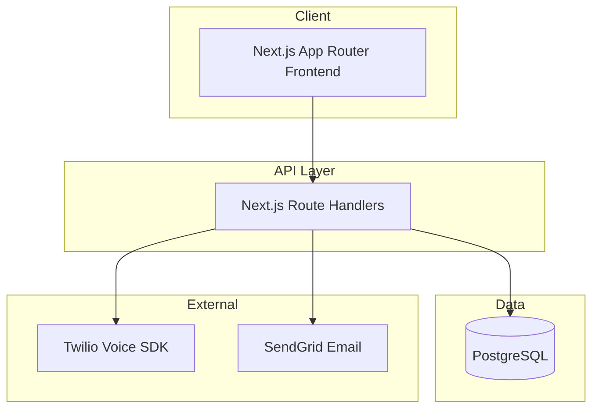

# System Map

> **Project status:** First-Job MVP — structure below is **Implemented** unless marked otherwise.

## High-Level Architecture (Implemented)



## Frontend Structure

**Status: Implemented**

```txt
src/
  app/               # Next.js App Router pages and layouts
  components/        # React components (admin, homeowner, contractor)
  lib/               # Utilities, state machines, API wrappers
```

## Backend Structure

**Status: Implemented**

```txt
src/
  app/api/           # Next.js Route Handlers (REST API)
  lib/               # Business logic, auth, config
prisma/              # Database schema and seed data
```

## Database Structure

**Status: Implemented**

PostgreSQL schema via Prisma. Contains 13 models (User, ContractorProfile, CapacityCell, ProjectRequest, Appointment, AuditEvent, Invoice, Feedback, CaseStudy, Dispute, ContractorInquiry, Notification, CallLog).
See `docs/architecture/DATABASE_SCHEMA.md` and `prisma/schema.prisma`.

## Authentication Flow

**Status: Implemented**

1. User logs in with email/password.
2. Server issues JWT session cookie via `jose`.
3. Middleware and route handlers protect routes via `src/lib/auth.ts`.
4. Role checks (9 roles) on sensitive actions.

## Authorization / RBAC Flow

**Status: Implemented**

- Role assigned per user (e.g., SUPER_ADMIN, OPS_AGENT, HOMEOWNER, CONTRACTOR).
- API middleware/guards (`src/lib/authorization.ts`) enforce permissions.
- UI hides actions user cannot perform.

## External Integrations

**Status: Implemented**

| Integration | Purpose | Status |
|-------------|---------|--------|
| Email (SendGrid) | Notifications | Implemented |
| Voice (Twilio) | Softphone dialer | Implemented |
| Object storage | File uploads | Planned |
| Payment | Invoicing | Planned |

## Background Jobs

**Status: Planned**

No queue infrastructure exists yet. Actions are processed synchronously in Route Handlers.

## Deployment Flow

**Status: Implemented (Docker)**

1. Docker Compose builds frontend/backend into a single container.
2. PostgreSQL runs in a separate container.
3. Accessible on port 7090.

## Important Directories

| Path | Status | Purpose |
|------|--------|---------|
| `/docs` | Implemented | Project documentation |
| `/docs/context` | Implemented | Living project state |
| `src/` | Implemented | Application source code |
| `prisma/` | Implemented | Database schema and seed |

## Important Configuration Files

| File | Status |
|------|--------|
| `package.json` | Implemented |
| `.env.example` | Implemented |
| `docker-compose.yml` | Implemented |
| CI config | Planned |

## Current Implementation Status

| Layer | Status |
|-------|--------|
| Documentation | In Progress |
| Frontend app | Implemented (Next.js) |
| Backend API | Implemented (Route Handlers) |
| Database | Implemented (PostgreSQL/Prisma) |
| Auth | Implemented (JWT) |
| File storage | Planned |
| CI/CD | Planned |
