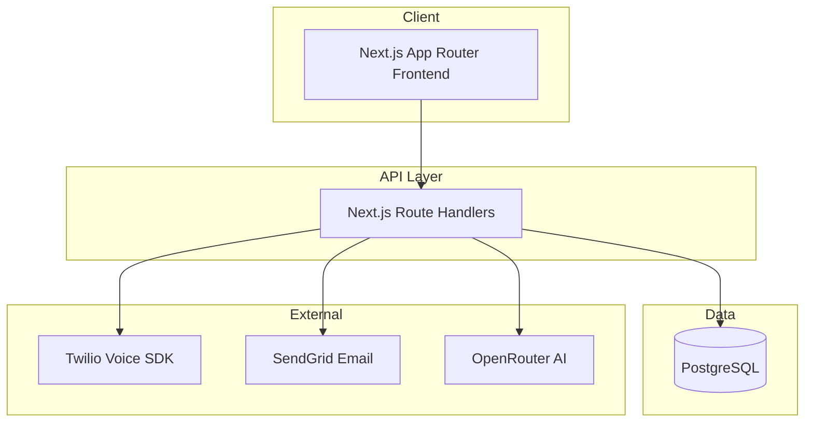

# System Map

> **Project status:** First-Job MVP — structure below is **Implemented** unless marked otherwise.

## High-Level Architecture (Implemented)


```mermaid
flowchart TB
    subgraph client [Client]
        Web[Next.js App Router Frontend]
    end
    subgraph api [API Layer]
        API[Next.js Route Handlers]
    end
    subgraph data [Data]
        DB[(PostgreSQL)]
    end
    subgraph external [External]
        Twilio[Twilio Voice SDK]
        SendGrid[SendGrid Email]
        AI[OpenRouter AI]
    end
    Web --> API
    API --> DB
    API --> Twilio
    API --> SendGrid
    API --> AI
```

## Frontend Structure

**Status: Implemented**

```txt
src/
  app/               # Next.js App Router pages and layouts
  components/        # React components (admin, homeowner, contractor)
  lib/               # Utilities, state machines, API wrappers
```

## Backend Structure

**Status: Implemented**

```txt
src/
  app/api/           # Next.js Route Handlers (REST API)
  lib/               # Business logic, auth, config
prisma/              # Database schema and seed data
```

## Database Structure

**Status: Implemented**

PostgreSQL schema via Prisma. In addition to marketplace and communications models, `ConsentEvent` provides immutable clickwrap/consent evidence and `CommunicationSuppression` provides current channel-specific opt-out state.
See `docs/architecture/DATABASE_SCHEMA.md` and `prisma/schema.prisma`.

## Authentication Flow

**Status: Implemented**

1. User logs in with email/password.
2. Server issues JWT session cookie via `jose`.
3. Middleware and route handlers protect routes via `src/lib/auth.ts`.
4. Role checks (9 roles) on sensitive actions.

## Authorization / RBAC Flow

**Status: Implemented**

- Role assigned per user (e.g., SUPER_ADMIN, OPS_AGENT, HOMEOWNER, CONTRACTOR).
- API middleware/guards (`src/lib/authorization.ts`) enforce permissions.
- UI hides actions user cannot perform.

## External Integrations

**Status: Implemented**

| Integration | Purpose | Status |
|-------------|---------|--------|
| Email (SendGrid) | Notifications | Implemented |
| Voice (Twilio) | Softphone dialer | Implemented |
| SMS (Twilio) | Signed inbound STOP/opt-out processing | Implemented; provider routing requires configuration |
| AI (OpenRouter) | Informational advisor and RFQ preparation | Implemented; no direct booking/account mutation |
| Object storage | File uploads | Planned |
| Payment | Invoicing | Planned |

## Background Jobs

**Status: Planned**

No queue infrastructure exists yet. Actions are processed synchronously in Route Handlers.

## Deployment Flow

**Status: Implemented (Docker)**

1. Docker Compose builds frontend/backend into a single container.
2. PostgreSQL runs in a separate container.
3. Accessible on port 7090.

## Important Directories

| Path | Status | Purpose |
|------|--------|---------|
| `/docs` | Implemented | Project documentation |
| `/docs/context` | Implemented | Living project state |
| `src/` | Implemented | Application source code |
| `prisma/` | Implemented | Database schema and seed |

## Important Configuration Files

| File | Status |
|------|--------|
| `package.json` | Implemented |
| `.env.example` | Implemented |
| `docker-compose.yml` | Implemented |
| CI config | Planned |

## Solar module map (`src/lib/solar/`, `src/components/solar/`)

Deployed 2026-08-10, flags mostly OFF. Isolated from bathroom; shares only `db`, `auth`, `audit`, `seo`, `compliance`, `feature-flags` and the design tokens, and promotes into the shared `ProjectRequest` lead pipeline.

| Path | Role |
|------|------|
| `lib/solar/providers/` | **The only place third-party JSON exists.** `google-geocoding`, `google-solar`, `pvwatts`, `openei`, `configured-incentives`, `http` (timeout/retry/typed failure), `index` (registry + availability report) |
| `lib/solar/types.ts` | Renovessa's domain vocabulary — everything downstream speaks this |
| `lib/solar/provenance.ts` | `Tracked<T>` value wrapper; blocks unconfirmed AI extraction from financial use |
| `lib/solar/versions.ts` | Immutable calculation version ids stored on every estimate |
| `lib/solar/layout-engine.ts` | Deterministic panel selection from provider candidates; system sizing |
| `lib/solar/production.ts` | Two-model reconciliation (never "pick the larger") |
| `lib/solar/consumption.ts` | Strict input hierarchy; returns null rather than a national average |
| `lib/solar/cost-engine.ts` + `pricing-config.ts` | Deterministic $/W + adders; fail-closed public display |
| `lib/solar/confidence.ts` | Five dimensions → overall + improvement actions |
| `lib/solar/plan.ts` | Composes the engines into one `SolarPlanResult` |
| `lib/solar/manual-roof.ts` | No-dead-end path when geospatial coverage is missing |
| `lib/solar/brief.ts` | Contractor-ready Solar Project Brief |
| `lib/solar/geo.ts` | Equirectangular projection for the roof visualizer |
| `components/solar/RoofVisualizer.tsx` | SVG render of real provider geometry + accessible textual equivalent |
| `components/solar/SolarPlanner.tsx` | Step machine, anonymous draft, debounced autosave, live replan |
| `app/api/solar-projects/*`, `app/api/solar/*` | Route handlers; keys never reach the browser |
| `app/solar/*` | Landing, planner, methodology — all `force-dynamic` |
| `app/portal/admin/solar/*` | Funnel/failure dashboard + pricing configuration |

## Current Implementation Status

| Layer | Status |
|-------|--------|
| Documentation | In Progress |
| Frontend app | Implemented (Next.js) |
| Backend API | Implemented (Route Handlers) |
| Database | Implemented (PostgreSQL/Prisma) |
| Auth | Implemented (JWT) |
| File storage | Planned |
| CI/CD | Planned |
