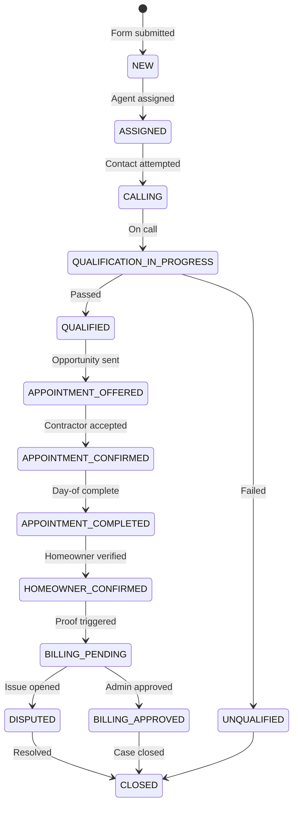
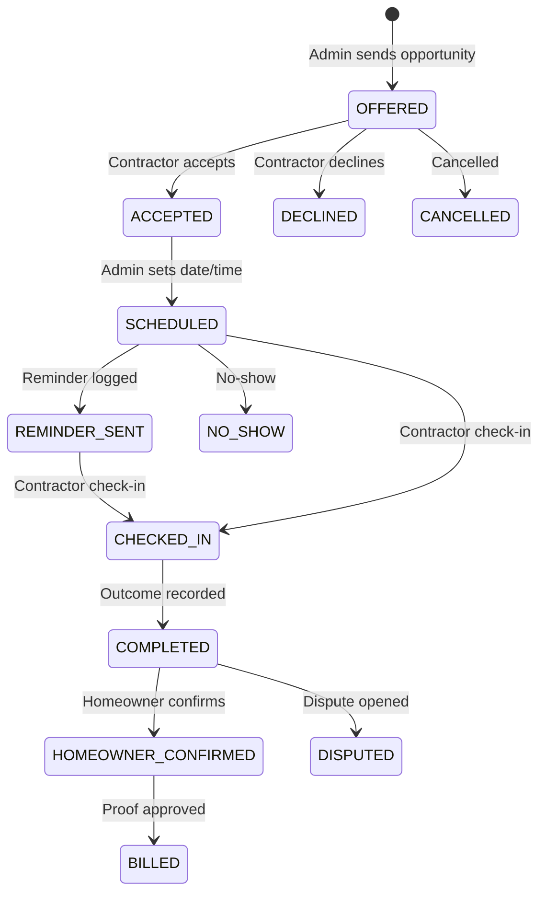

# First-Job MVP Implementation Plan

> **Created:** 2026-06-11  
> **Status:** Accepted for implementation  
> **Scope:** One contractor, one verified appointment, Pakistan ops team as US-facing appointment desk  
> **Baseline:** First-Job MVP review (2026-06-11) — current readiness ~38%

## Document Purpose

This plan turns Renovessa from a **demo shell** into an **operations tool** that can complete one verified appointment with one onboarded contractor. It is scoped strictly to the first-job MVP — not marketplace scale, not Angi/HomeAdvisor parity.

**Related docs:**
- `docs/context/CURRENT_STATE.md` — what exists today
- `docs/planning/DEVELOPMENT_PHASES.md` — broader phase map
- `docs/planning/REQUIREMENTS_BACKLOG.md` — general backlog
- `docs/architecture/DATABASE_SCHEMA.md` — schema reference (update as phases land)

---

## 1. Review Summary (Context)

### Current state

| Layer | Readiness |
|-------|-----------|
| Schema / data model | ~75% |
| Public intake | ~55% |
| Admin ops writes | ~15% |
| Appointment lifecycle | ~20% |
| Audit completeness | ~40% |
| Proof / billing / feedback | ~15% |
| **Overall first-job readiness** | **~38%** |

### What works today

- Public form → real `ProjectRequest` row + audit events (`POST /api/project-requests`)
- Admin lead lists and read-only detail pages
- Lead status PATCH (dropdown only)
- Contractor accept / check-in APIs (when appointment exists)
- Homeowner confirm API (gated on `SCHEDULED` only)
- Demo seed tells a complete story (Sarah HVAC flow)

### Top blockers

1. No appointment offer/creation workflow (appointments only in `prisma/seed.ts`)
2. No scheduling UI/API
3. Broken accept → homeowner confirm chain (`ACCEPTED` vs `SCHEDULED` gate)
4. No qualification workspace (notes/disposition not editable)
5. No billing proof trigger on verification

### Top risks

1. Incomplete audit trail undermines “proof is mandatory” strategy
2. Unauthenticated `GET /api/project-requests` exposes PII
3. Ops will bypass app for WhatsApp/Sheets when write paths missing
4. Marketplace landing attracts unmatched demand (12 categories)
5. Demo seed works; real path does not — false confidence

### Verdict

**Do not attempt the first real job until Sprint 5 of this plan is complete.**

---

## 2. Goal and Definition of Done

### Primary goal

Enable the Pakistan ops team to run this workflow entirely in-app (manual phone/SMS allowed, but **logged**):

```
Homeowner submits → Ops qualifies → Opportunity sent → Contractor accepts →
Appointment scheduled → Both sides confirmed → Appointment day tracked →
Both outcomes recorded → Audit trail complete → Pilot billing proof created →
Feedback captured → Case study drafted
```

### Launch gate (definition of done)

A non-developer ops agent can, **without touching the database or seed scripts**:

1. Create one pilot contractor and lock one capacity cell
2. Receive a real homeowner request on a single-service landing page
3. Qualify the homeowner with notes and required fields
4. Send an opportunity to the contractor
5. Record contractor accept/decline
6. Schedule the appointment with date, time, and location
7. Log calls, SMS, and reminders
8. Record contractor check-in and outcome
9. Record homeowner post-appointment confirmation
10. See a complete audit trail for the lead
11. Create/approve a $0 pilot billing proof record
12. Open and resolve a dispute if needed
13. Enter feedback and a case study draft

**Acceptance test:** Run the full flow with fresh data (not Sarah/Lena seed records) in under 45 minutes of ops time, with zero Prisma Studio edits.

---

## 3. Implementation Principles

| Principle | Application |
|-----------|-------------|
| **Proof over polish** | Ship write paths before redesigning marketing pages |
| **Log everything manual** | Phone/WhatsApp OK; every action gets an audit/comm record |
| **One contractor, one cell** | Config-driven wedge; hide marketplace breadth |
| **Extend schema minimally** | Add fields to existing models before new tables |
| **State machine is law** | APIs enforce valid transitions; UI cannot skip gates |
| **Append-only audit** | No silent edits to audit events |
| **Reuse patterns** | Match `PATCH /api/leads/[id]`, `logAuditEvent`, portal layouts |

---

## 4. Architecture Overview

### 4.1 Lead workflow state machine



### 4.2 Appointment sub-state machine



### 4.3 Proposed module layout

```
src/
  lib/
    first-job-config.ts      # Single contractor/cell wedge config
    lead-state-machine.ts    # Valid transitions + guards
    appointment-state-machine.ts
    authorization.ts         # Resource ownership checks
  app/api/
    appointments/route.ts                    # POST create offer
    appointments/[id]/route.ts               # PATCH schedule/reschedule/cancel
    appointments/[id]/decline/route.ts
    appointments/[id]/outcome/route.ts
    leads/[id]/route.ts                      # Extend PATCH (qualification fields)
    leads/[id]/communications/route.ts       # POST log call/SMS/note
    leads/[id]/assign/route.ts
    contractors/route.ts                     # POST create
    contractors/[id]/route.ts                # PATCH update
    billing/proof/route.ts                   # POST create proof from appointment
    billing/proof/[id]/route.ts              # PATCH approve/waive
    disputes/route.ts                        # POST open
    disputes/[id]/route.ts                   # PATCH resolve
    feedback/route.ts
    case-studies/route.ts
    confirm/[token]/route.ts                 # P1 magic-link homeowner confirm
  components/admin/
    QualificationPanel.tsx
    CommunicationLogForm.tsx
    OpportunityPanel.tsx
    ScheduleAppointmentForm.tsx
    AppointmentDayPanel.tsx
    BillingProofPanel.tsx
    FeedbackForm.tsx
    CaseStudyForm.tsx
```

---

## 5. Phased Delivery Plan

**Estimated timeline:** 4–5 weeks (one full-stack developer) or 2–3 weeks (P0 only, aggressive focus).

---

### Phase 0 — Foundation & Security (Days 1–2)

**Objective:** Safe baseline before building ops workflows.

| # | Task | Details | Files |
|---|------|---------|-------|
| 0.1 | Lock down public lead API | Remove or auth-protect `GET /api/project-requests` | `src/app/api/project-requests/route.ts` |
| 0.2 | Add resource authorization helpers | `assertLeadAccess`, `assertAppointmentAccess`, `assertContractorOwnsAppointment` | `src/lib/authorization.ts` |
| 0.3 | Fix appointment API ownership | Accept/checkin/confirm verify contractor/homeowner owns record | `src/app/api/appointments/[id]/*` |
| 0.4 | Add first-job config | Env-driven wedge: `PILOT_TRADE`, `PILOT_ZIPS`, `PILOT_CONTRACTOR_ID`, `PILOT_MIN_BUDGET`, public phone | `src/lib/first-job-config.ts`, `.env.example` |
| 0.5 | Centralize state machines | Export `canTransitionLead()`, `canTransitionAppointment()` | `src/lib/lead-state-machine.ts`, `src/lib/appointment-state-machine.ts` |

**Acceptance criteria:**
- Unauthenticated request to list leads returns 401
- Contractor cannot accept another contractor's appointment
- Homeowner cannot confirm unrelated appointment

---

### Phase 1 — Schema Extensions (Days 3–5)

**Objective:** Persist all first-job fields without over-modeling.

#### 1A. Extend `ProjectRequest`

| Field | Type | Purpose |
|-------|------|---------|
| `address` | `String?` | Partial/full project address |
| `ownershipAuthority` | `String?` | Owner/renter/decision-maker |
| `preferredAppointmentWindows` | `String?` | Free text or JSON string |
| `photoUrls` | `String[]` | P1; optional URLs |
| `serviceCellMatch` | `Boolean?` | Fit check result |
| `invalidReason` | `String?` | Out of area, wrong trade, etc. |
| `reachable` | `Boolean?` | Contact outcome |

#### 1B. Extend `ContractorProfile`

| Field | Type | Purpose |
|-------|------|---------|
| `contactPerson` | `String?` | Primary contact |
| `availabilityNotes` | `String?` | Appointment windows |
| `pilotTerms` | `String?` | Pilot agreement summary |
| `firstAppointmentPricing` | `String?` | `free` / `discounted` / `paid` |
| `pilotPriceAmount` | `Float?` | e.g. 0 or 175 |
| `responseTimeHours` | `Int?` | SLA expectation |
| `googleBusinessUrl` | `String?` | Trust link |
| `internalNotes` | `String?` | Ops-only |

#### 1C. Extend `Appointment`

| Field | Type | Purpose |
|-------|------|---------|
| `location` | `String?` | Appointment address |
| `homeownerPreConfirmed` | `Boolean` @default(false) | Pre-day confirmation |
| `contractorPreConfirmed` | `Boolean` @default(false) | Pre-day confirmation |
| `estimateGiven` | `String?` | `yes` / `no` / `unknown` |
| `contractorOutcomeNotes` | `String?` | Post-visit notes |
| `homeownerOutcomeNotes` | `String?` | Post-visit notes |
| `followUpRequired` | `Boolean` @default(false) | Escalation flag |
| `opportunitySentAt` | `DateTime?` | When sent to contractor |
| `declineReason` | `String?` | If declined |
| `pilotBillableReason` | `String?` | Why billable/waived |

#### 1D. Extend `Invoice` (pilot proof)

| Field | Type | Purpose |
|-------|------|---------|
| `pilotProof` | `Boolean` @default(true) | Distinguish from future billing |
| `waivedReason` | `String?` | Credit/waiver note |
| `approvedById` | `String?` | FK → User |
| `approvedAt` | `DateTime?` | Approval timestamp |

#### 1E. New models (minimal)

**`Feedback`** (per appointment, `actorType` HOMEOWNER | CONTRACTOR):

```
id, appointmentId, actorType, responses Json, createdAt
```

**`CaseStudy`:**

```
id, projectRequestId, trade, zipCode, leadSource, timingMetrics Json,
homeownerConfirmed, contractorAttended, estimateGiven, disputeOccurred,
lessonsLearned, nextImprovement, status (DRAFT|FINAL), createdAt
```

**Communication logging:** Use existing `AuditEvent` with `NOTE_ADDED`, `CALL_MADE`, `SMS_SENT` and structured `metadata` for first job. Separate `CommunicationLog` model is P1 if needed.

**Migration:** `npm run db:push` (existing project pattern); update `prisma/seed.ts` after schema stabilizes.

**Acceptance criteria:**
- All new fields visible in Prisma client
- Seed still runs without error
- Update `docs/architecture/DATABASE_SCHEMA.md`

---

### Phase 2 — Public Intake Wedge (Days 6–8)

**Objective:** One honest landing page that only accepts demand matching the pilot contractor.

| # | Task | Details | Files |
|---|------|---------|-------|
| 2.1 | First-job landing mode | When `FIRST_JOB_MODE=true`, show single trade + geography copy | `src/lib/landing-data.ts`, `src/components/landing/*` |
| 2.2 | Remove fake claims | Remove static `STATS`, `APPOINTMENT_LOG`; replace with honest trust section | `landing-data.ts`, `StatsStrip.tsx` |
| 2.3 | Unify intake to one form | Redirect `/for-homeowners` → `/#request` or deprecate duplicate | `src/app/for-homeowners/page.tsx` |
| 2.4 | Add missing form fields | Address, ownership, preferred appointment windows | `LandingProjectForm.tsx` |
| 2.5 | Service cell validation | Check ZIP in `PILOT_ZIPS`, trade matches `PILOT_TRADE`; soft-warn or hard-block (configurable) | Form + `POST /api/project-requests` |
| 2.6 | Restrict categories | Only show pilot trade in category selector | `landing-data.ts` or config filter |
| 2.7 | Extend POST API | Persist new fields + `serviceCellMatch` + audit | `project-requests/route.ts` |
| 2.8 | Consistent thank-you | Always show receipt with reference; align timing copy (4 business hours) | `LandingProjectForm.tsx`, `thank-you/page.tsx` |
| 2.9 | Real contact phone | Replace `(202) 555-0100` with `NEXT_PUBLIC_OPS_PHONE` | Header/footer components |

**Landing copy target (example):**

> "Need HVAC help in Fairfax? Renovessa coordinates a qualified contractor appointment for homeowners — one project, one contractor, no obligation."

**Acceptance criteria:**
- Out-of-cell ZIP flags `serviceCellMatch: false` (and optionally blocks submit per config)
- No marketplace stats or fake testimonials
- Form creates lead with address, ownership, appointment windows

---

### Phase 3 — Admin Operations Spine (Days 9–14)

**Objective:** Pakistan team can qualify and log work in-app.

#### 3A. Lead intake queue improvements

| # | Task | Details |
|---|------|---------|
| 3.1 | Expand ops queues | Add: `ASSIGNED`, `QUALIFIED`, `APPOINTMENT_OFFERED`, `APPOINTMENT_CONFIRMED`, `APPOINTMENT_COMPLETED` |
| 3.2 | Queue → detail links | Each queue card links to `/portal/admin/leads/[id]` |
| 3.3 | Agent assignment | `POST /api/leads/[id]/assign` sets `assignedAgentId`, status `ASSIGNED` |
| 3.4 | Full status dropdown | `LeadActions` uses all `LeadStatus` values with `LEAD_STATUS_LABELS` |
| 3.5 | Transition guards | PATCH rejects invalid transitions via state machine |

#### 3B. Qualification workspace

New **`QualificationPanel`** on lead detail (`src/app/portal/admin/leads/[id]/page.tsx`):

| Section | Fields / actions |
|---------|------------------|
| Checklist | Project type verified, ZIP verified, ownership, urgency, budget, appointment windows |
| Contact | Mark reachable / unreachable; log call attempt |
| Consent | Display `tcpaConsent` + timestamp from audit |
| Photos | Display `photoUrls` if present |
| Notes | `qualificationNotes`, `disposition` |
| Outcome buttons | **Mark Qualified** / **Mark Unqualified** (with reason) |

**Gating rule:** Cannot set `QUALIFIED` unless `qualificationNotes`, `ownershipAuthority`, `reachable === true`, and at least one contact attempt logged.

**Extend `PATCH /api/leads/[id]`** to accept:

```typescript
{
  status?, qualificationNotes?, disposition?, assignedAgentId?,
  ownershipAuthority?, reachable?, invalidReason?
}
```

Log `QUALIFICATION_DECISION` audit on qualify/unqualify.

#### 3C. Communication logging

**`CommunicationLogForm`** on lead detail:

- Types: Call attempted / Call completed / Voicemail / SMS / Email / Internal note
- Creates `AuditEvent` with `eventType` + `metadata: { channel, outcome }`

**API:** `POST /api/leads/[id]/communications`

**Acceptance criteria:**
- Ops can qualify a new lead without status dropdown alone
- Every call attempt creates audit record with actor and timestamp
- Invalid status jumps rejected with clear error

---

### Phase 4 — Appointment Lifecycle (Days 15–21) — Critical Path

**Objective:** Close the biggest blocker — offer through confirmation.

#### 4A. Contractor admin CRUD

| # | Task | Details |
|---|------|---------|
| 4.1 | Contractor detail page | `/portal/admin/contractors/[id]` edit form |
| 4.2 | Create contractor | `POST /api/contractors` creates `User` + `ContractorProfile` + links capacity cell |
| 4.3 | Update contractor | `PATCH /api/contractors/[id]` for all MVP fields |
| 4.4 | Capacity cell editor | Form on capacity page: trade, ZIPs, min/max job size, status, linked contractor |

#### 4B. Opportunity sending

**`OpportunityPanel`** on lead detail (visible when lead `QUALIFIED`):

| Display | Action |
|---------|--------|
| Project summary | Select contractor (default: pilot contractor) |
| Homeowner qualified: yes | **Send Opportunity** |
| Consent: yes | Creates appointment |

**`POST /api/appointments`:**

```typescript
{
  projectRequestId: string,
  contractorId: string,
  amount?: number,
  notes?: string
}
```

**Side effects:**
- Create `Appointment` status `OFFERED`, `opportunitySentAt: now`
- Lead → `APPOINTMENT_OFFERED`
- Audit: `CONTRACTOR_OFFERED`
- Manual-send: "Sent via WhatsApp manually" checkbox still creates record

#### 4C. Contractor acceptance / decline

| Endpoint | Behavior |
|----------|----------|
| `POST /api/appointments/[id]/accept` | Verify ownership; `ACCEPTED`; lead `APPOINTMENT_CONFIRMED`; audit `CONTRACTOR_ACCEPTED` |
| `POST /api/appointments/[id]/decline` | `DECLINED` + `declineReason`; lead → `SCHEDULING` or `QUALIFIED`; audit `CONTRACTOR_DECLINED` |
| Admin override | Admin records accept/decline on behalf of contractor |

**Contractor portal:** Add decline button; show opportunity details (name, ZIP, trade, urgency, budget, windows — hide full address until accepted).

#### 4D. Scheduling & confirmation

**`ScheduleAppointmentForm`** on lead detail:

| Field | Required |
|-------|----------|
| `scheduledAt` | Yes |
| `location` | Yes |
| Calendar link (external URL) | Optional |

**`PATCH /api/appointments/[id]`** actions:
- `schedule` → `SCHEDULED`, set `scheduledAt`, `location`; audit `CALENDAR_INVITE_SENT`
- `reschedule` → update datetime; audit note
- `cancel` → `CANCELLED`
- `mark_reminder_sent` → `REMINDER_SENT`; audit `REMINDER_SENT`

**Pre-appointment flags:** `homeownerPreConfirmed`, `contractorPreConfirmed` — admin toggles after phone/SMS.

#### 4E. Fix homeowner confirm chain

**Implement:** Contractor accept → admin schedule → homeowner can confirm.

Update `src/app/portal/homeowner/page.tsx` confirm gate:

```typescript
["SCHEDULED", "REMINDER_SENT", "CHECKED_IN", "COMPLETED"].includes(status)
```

**P1:** Magic-link page `/confirm/[token]` for homeowners without portal accounts.

**Acceptance criteria:**
- Fresh lead reaches `OFFERED` without seed data
- Contractor accept → admin schedule → homeowner confirm works E2E
- Decline returns lead to ops with reason

---

### Phase 5 — Post-Appointment Proof (Days 22–26)

**Objective:** Mandatory proof artifacts after the visit.

#### 5A. Appointment-day control

**`AppointmentDayPanel`** (admin + contractor):

| Field | Who sets |
|-------|----------|
| Contractor attendance | Contractor check-in or admin |
| `estimateGiven` | Contractor or admin |
| `contractorOutcomeNotes` | Contractor or admin |
| No-show classification | Admin |
| `followUpRequired` | Admin |

**`POST /api/appointments/[id]/outcome`:** Sets `COMPLETED` or `NO_SHOW`; lead → `APPOINTMENT_COMPLETED`; audit events.

#### 5B. Homeowner confirmation (post-visit)

Extend confirm flow:
- Attended yes/no/rescheduled
- Professionalism rating (1–5)
- `homeownerOutcomeNotes`

Store in `Feedback` or appointment fields; audit `HOMEOWNER_CONFIRMED`.

**Admin manual path:** Form on lead detail if homeowner confirms by phone.

#### 5C. Pilot billing proof

**Trigger on `HOMEOWNER_CONFIRMED`:**

1. Create `Invoice` with `pilotProof: true`, `amount: 0` (or pilot amount)
2. Set `appointment.billingTriggered = true`
3. Lead → `BILLING_PENDING`
4. Audit: `BILLING_TRIGGER`

**`BillingProofPanel`:** Approve, Waive (with reason), Credit → `BILLING_APPROVED`; audit `CREDIT_ISSUED` if waived.

#### 5D. Disputes

| # | Task |
|---|------|
| 5.1 | `POST /api/disputes` from appointment |
| 5.2 | Lead → `DISPUTED`; audit `DISPUTE_OPENED` |
| 5.3 | `PATCH /api/disputes/[id]` — outcome, resolution notes; audit `DISPUTE_RESOLVED` |
| 5.4 | Wire outcomes to billing waive/credit |

#### 5E. Feedback & case study

| # | Task |
|---|------|
| 5.1 | `FeedbackForm` — homeowner + contractor questions per MVP spec |
| 5.2 | `POST /api/feedback` linked to appointment |
| 5.3 | `CaseStudyForm` — auto-compute timing from audit timestamps |
| 5.4 | `POST /api/case-studies` status `DRAFT` |

**Acceptance criteria:**
- Completing flow creates invoice proof record
- Dispute can be opened and resolved in-app
- Feedback and case study exist for completed appointment

---

### Phase 6 — Seed, Test & Launch (Days 27–30)

| # | Task | Details |
|---|------|---------|
| 6.1 | First-job seed profile | 1 contractor, 1 cell, 1 complete demo flow + 1 in-progress lead |
| 6.2 | Demo banner | Show "Demo data" when `isDemo: true` |
| 6.3 | E2E runbook | Written ops runbook for 18-step workflow (see Section 10) |
| 6.4 | Production prep | `RUN_SEED=false`, purge `isDemo` records before real job |
| 6.5 | Update docs | `CURRENT_STATE.md`, `API_CONTRACTS.md`, `AGENT_HANDOFF.md`, `DATABASE_SCHEMA.md` |
| 6.6 | Security pass | All write APIs authenticated; no public PII endpoints |

---

## 6. API Contract Summary

| Method | Path | Auth | Purpose |
|--------|------|------|---------|
| POST | `/api/appointments` | Admin | Create opportunity |
| PATCH | `/api/appointments/[id]` | Admin | Schedule/reschedule/cancel/reminder |
| POST | `/api/appointments/[id]/decline` | Contractor/Admin | Decline opportunity |
| POST | `/api/appointments/[id]/outcome` | Contractor/Admin | Day-of outcome |
| PATCH | `/api/leads/[id]` | Admin | Status + qualification fields |
| POST | `/api/leads/[id]/assign` | Admin | Assign agent |
| POST | `/api/leads/[id]/communications` | Admin | Log call/SMS/note |
| POST | `/api/contractors` | Admin | Onboard contractor |
| PATCH | `/api/contractors/[id]` | Admin | Update contractor |
| POST | `/api/billing/proof` | Admin | Create proof record |
| PATCH | `/api/billing/proof/[id]` | Admin/Finance | Approve/waive |
| POST | `/api/disputes` | Admin/Homeowner | Open dispute |
| PATCH | `/api/disputes/[id]` | Admin | Resolve |
| POST | `/api/feedback` | Admin | Record feedback |
| POST | `/api/case-studies` | Admin | Create case study |
| GET | `/api/confirm/[token]` | Public | P1 magic-link confirm page data |
| POST | `/api/confirm/[token]` | Public | P1 submit confirmation |

**Fix existing:** `GET /api/project-requests` → admin-only or remove.

---

## 7. UI Page Changes Summary

| Page | Changes |
|------|---------|
| `/` (landing) | First-job mode, honest copy, single trade, no fake stats |
| `/portal/admin/operations` | Full queues, links to leads |
| `/portal/admin/leads/[id]` | Qualification, comm log, opportunity, schedule, day-of, billing, feedback, case study panels |
| `/portal/admin/contractors` | Add/create/edit links |
| `/portal/admin/contractors/[id]` | New edit form |
| `/portal/admin/appointments` | Filter today; link to lead; quick actions |
| `/portal/admin/finance` | Approve/waive actions |
| `/portal/admin/disputes` | Open/resolve actions |
| `/portal/contractor` | Decline, outcome form, limited opportunity detail |
| `/portal/homeowner` | Fix confirm gate |
| `/confirm/[token]` | P1 new public confirmation page |

---

## 8. Environment Variables

Add to `.env.example`:

```bash
# First-job wedge
FIRST_JOB_MODE=true
PILOT_TRADE=HVAC
PILOT_ZIP_CLUSTERS=22030,22031,22032,22033
PILOT_MIN_BUDGET=1000
PILOT_CONTRACTOR_ID=
NEXT_PUBLIC_OPS_PHONE=+1-XXX-XXX-XXXX
NEXT_PUBLIC_LANDING_HEADLINE=Need HVAC help in Fairfax?

# Existing
AUTH_SECRET=change-me-to-a-long-random-string-in-production
DATABASE_URL=postgresql://renovessa:renovessa@db:5432/renovessa?schema=public
NEXT_PUBLIC_APP_URL=http://localhost:7090
PORT=7090
```

---

## 9. What Stays Manual (Explicitly Supported)

| Activity | In-app requirement |
|----------|-------------------|
| Homeowner qualification call | Log call + notes; mark qualified |
| Contractor WhatsApp outreach | "Send opportunity" creates record; optional "manual sent" flag |
| SMS/email reminders | "Mark reminder sent" button |
| Google Calendar invite | Paste external link in schedule form |
| Payment collection | $0 pilot proof only |
| Case study prose | Admin types; system captures metrics |
| Photo review | URLs pasted in qualification until upload built (P1) |

### What must be in the app (cannot live only in WhatsApp/Sheets)

| Record | Target state after plan |
|--------|-------------------------|
| Homeowner request | ✅ Already works |
| Consent | ✅ Already works |
| Contractor record | Phase 4A |
| Qualification result | Phase 3B |
| Contractor acceptance | Phase 4C |
| Appointment schedule | Phase 4D |
| Appointment status | Phase 4 |
| Homeowner confirmation | Phase 4E + 5B |
| Contractor outcome | Phase 5A |
| Audit trail | All phases |
| Dispute | Phase 5D |
| Billing/proof record | Phase 5C |
| Feedback summary | Phase 5E |
| Case study notes | Phase 5E |

---

## 10. Mandatory Feature Scorecard (Target)

| # | MVP Feature | P0? | Current | Target after plan |
|---|-------------|-----|---------|-------------------|
| 1 | Focused landing page | Yes | Incorrect | Phase 2 |
| 2 | Project request form | Yes | Partial | Phase 2 |
| 3 | Service cell / fit check | Yes | Missing | Phase 2 |
| 4 | Contractor onboarding record | Yes | Partial | Phase 4A |
| 5 | Admin lead intake queue | Yes | Partial | Phase 3A |
| 6 | Qualification workspace | Yes | Missing | Phase 3B |
| 7 | Contractor opportunity sending | Yes | Missing | Phase 4B |
| 8 | Contractor acceptance | Yes | Partial | Phase 4C |
| 9 | Appointment scheduling | Yes | Missing | Phase 4D |
| 10 | Communication logging | Yes | Partial | Phase 3C |
| 11 | Appointment-day control | Yes | Partial | Phase 5A |
| 12 | Homeowner confirmation | Yes | Partial | Phase 4E, 5B |
| 13 | Contractor outcome confirmation | Yes | Partial | Phase 5A |
| 14 | Audit trail | Yes | Partial | All phases |
| 15 | Pilot billing / proof | Yes | Partial | Phase 5C |
| 16 | Dispute handling | Yes | Partial | Phase 5D |
| 17 | Feedback collection | Yes | Missing | Phase 5E |
| 18 | Case study record | Yes | Missing | Phase 5E |
| 19 | RBAC / access control | Yes | Partial | Phase 0 |
| 20 | Demo / seed data | Yes | Done | Phase 6 |

---

## 11. End-to-End Workflow Test (Launch Runbook)

| Step | Target status after plan |
|------|--------------------------|
| 1. Admin creates/onboards one contractor | Works E2E |
| 2. Contractor service cell locked | Works E2E |
| 3. Homeowner submits matching request | Works E2E |
| 4. Request appears in admin queue | Works E2E |
| 5. Admin qualifies homeowner | Works E2E |
| 6. Admin sends opportunity to contractor | Works E2E |
| 7. Contractor accepts or admin records acceptance | Works E2E |
| 8. Admin schedules appointment | Works E2E |
| 9. Homeowner confirms appointment | Works E2E |
| 10. Contractor confirms appointment | Works E2E (pre-confirm flags) |
| 11. Reminder sent or logged | Works E2E |
| 12. Appointment happens | Manual + logged |
| 13. Contractor outcome recorded | Works E2E |
| 14. Homeowner confirmation recorded | Works E2E |
| 15. Audit trail shows critical events | Works E2E (≥15 events) |
| 16. Pilot billing/proof record created | Works E2E |
| 17. Feedback collected | Works E2E |
| 18. Case study created | Works E2E |

---

## 12. Launch Readiness Checklist

### Contractor readiness
- [ ] Admin UI to create/edit one contractor profile
- [ ] One `CapacityCell` locked to that contractor
- [ ] Contractor login account provisioned
- [ ] Pilot agreement terms stored

### Homeowner intake readiness
- [ ] Single-service-cell landing page
- [ ] Form: address, ownership, appointment windows, consent
- [ ] ZIP/trade validation against contractor cell
- [ ] No fake marketing stats
- [ ] Lead API secured

### Admin operations readiness
- [ ] Qualification workspace with required fields
- [ ] Agent assignment
- [ ] Communication log UI
- [ ] Full lead status set
- [ ] Ops queue links to lead detail

### Appointment coordination readiness
- [ ] Create opportunity → `OFFERED`
- [ ] Record contractor accept/decline
- [ ] Schedule appointment
- [ ] Fix accept → confirm chain
- [ ] Log reminders
- [ ] Appointment-day admin view

### Audit / proof readiness
- [ ] All lifecycle audit events logged
- [ ] Post-verify billing proof ($0 pilot)
- [ ] Admin approve/waive with reason
- [ ] Append-only audit policy

### Dispute safety readiness
- [ ] Open dispute from appointment
- [ ] Resolve with outcome
- [ ] Link to billing credit/waive

### Feedback / case study readiness
- [ ] Feedback capture (both sides)
- [ ] Case study record with timing metrics

---

## 13. Prioritized Backlog

### P0 — Required before first real job (Phases 0–4 + billing minimum)

| Task | Phase | Reason |
|------|-------|--------|
| Secure lead API | 0 | PII leak |
| Appointment offer API + UI | 4B | Biggest blocker |
| Schedule API + UI | 4D | Cannot confirm without schedule |
| Fix accept → confirm chain | 4E | Broken E2E |
| Qualification workspace + gating | 3B | Ops cannot qualify in-app |
| Communication logging | 3C | Incomplete audit |
| Contractor admin CRUD | 4A | Cannot onboard real contractor |
| First-job landing + validation | 2 | Wrong demand + positioning |
| Billing proof trigger | 5C | Proof mandatory |

### P1 — Required before repeating workflow

| Task | Reason |
|------|--------|
| Magic-link homeowner confirm | Reduces portal dependency |
| Contractor decline + need-info | Real ops alternatives |
| Appointment-day admin panel | Day-of control |
| Full dispute open/resolve | Issue handling |
| Feedback + case study forms | Close the loop |
| Photo upload to storage | Qualification aid |
| Resource-level API auth hardening | Security |

### P2 — Deferred (platform scale)

Full marketplace, multi-contractor matching, Twilio/OpenPhone, Stripe, AI matching, marketing attribution, mobile apps, contractor acquisition CRM, advanced scorecards, HR/payroll, notifications UI, homeowner registration, full SEO site.

### Overbuilt features — defer or hide

| Feature | Action |
|---------|--------|
| 12 trade categories + house selector | Hide in `FIRST_JOB_MODE` |
| 3 demo contractors in seed | Replace with single pilot seed |
| Contractor scorecard KPIs | Keep hidden |
| 9 admin roles | Use Super Admin + Ops Agent only |
| `/for-homeowners` duplicate form | Redirect to `/#request` |
| Static marketing stats | Remove |
| Notifications model (no UI) | Defer |

---

## 14. Sprint Plan (Recommended Execution Order)

| Sprint | Focus | Phases | Outcome |
|--------|-------|--------|---------|
| **Sprint 1** | Foundation | 0 + 1 | Secure, schema ready |
| **Sprint 2** | Public wedge | 2 | Honest single-cell intake |
| **Sprint 3** | Ops spine | 3 | Qualification + comm logging |
| **Sprint 4** | Offer flow | 4A–4B | Contractor CRUD + opportunity send |
| **Sprint 5** | Appointment chain | 4C–4E | Accept, schedule, confirm fixed |
| **Sprint 6** | Proof layer | 5 | Outcomes, billing, disputes, feedback |
| **Sprint 7** | Launch | 6 | Seed, E2E test, docs, go-live gate |

**Gate:** Do not attempt first real job until **Sprint 5** is complete.

Sprints 1–3 can overlap with real-world contractor onboarding (pilot terms, ZIP list, availability) while engineering progresses.

---

## 15. Testing Strategy

### Per-phase tests

| Phase | Test type |
|-------|-----------|
| 0 | API auth unit tests for ownership helpers |
| 1 | Prisma schema smoke + seed |
| 2 | Form validation; manual submit test |
| 3 | State machine transition tests |
| 4 | Integration: lead → offer → accept → schedule → confirm |
| 5 | Integration: outcome → billing → dispute → feedback |
| 6 | Full 18-step ops runbook with fresh DB |

### E2E manual QA runbook

1. Set `FIRST_JOB_MODE=true`
2. Create contractor for pilot trade + ZIPs
3. Submit form as test homeowner
4. Qualify in admin (log 1 call)
5. Send opportunity
6. Login as contractor → accept
7. Admin schedule for tomorrow
8. Log reminder sent
9. Contractor check-in
10. Record outcome + estimate given
11. Homeowner confirm (portal or admin)
12. Verify audit trail ≥ 12 events
13. Approve $0 pilot proof
14. Enter feedback both sides
15. Save case study draft

**Pass:** All steps without DB/console access.

---

## 16. Risk Mitigation

| Risk | Mitigation |
|------|------------|
| Ops bypasses app | In-app steps faster than Sheets; gates block progress |
| Incomplete audit | State machine auto-logs every transition |
| Wrong demand (12 trades) | `FIRST_JOB_MODE` hides other categories |
| PII leak | Phase 0 security first |
| Demo false confidence | Separate first-job seed; demo banner |
| Pakistan team confusion | Call script in `QualificationPanel`; ops runbook in `docs/operations/` |

---

## 17. Success Metrics (First Job)

| Metric | Target |
|--------|--------|
| Audit events per completed job | ≥ 15 typed events |
| Time submit → qualified | Logged automatically |
| Time qualified → contractor accept | Logged automatically |
| Time accept → scheduled | Logged automatically |
| Homeowner + contractor confirmation | Both recorded |
| Pilot proof record | Created and approved (even at $0) |
| Dispute (if any) | Opened and resolved in-app |
| Case study | Draft exists with lessons learned |

---

## 18. Documentation Updates (Per Phase)

After each phase, update:

- `docs/context/CURRENT_STATE.md`
- `docs/context/PROGRESS_LOG.md` (append dated entry)
- `docs/context/AGENT_HANDOFF.md`
- `docs/context/NEXT_STEPS.md`
- `docs/architecture/API_CONTRACTS.md`
- `docs/architecture/DATABASE_SCHEMA.md`
- `docs/operations/` — add first-job ops runbook when Phase 6 completes

---

## 19. Operational Strategy Alignment

| Strategy element | Plan address |
|------------------|--------------|
| Start with one contractor | Phase 4A, 6.1 seed, `PILOT_CONTRACTOR_ID` |
| One narrow service cell | Phase 2, `FIRST_JOB_MODE` |
| No broad marketplace claims | Phase 2.2 |
| Contractor-first trust | Phase 4C contractor portal |
| First appointment free/discounted | Phase 5C pilot proof |
| Manual homeowner acquisition | Phase 2 form + Phase 3 qualification |
| Pakistan team as US-facing desk | Phase 3 qualification + comm logging |
| Qualification before contractor assignment | Phase 3B gating |
| Contractor acceptance before homeowner confirmation | Phase 4C–4E order |
| Post-appointment verification both sides | Phase 5A–5B |
| Full audit trail | All phases |
| Case study creation | Phase 5E |

---

## 20. Evidence References (Pre-Implementation)

Key gaps verified in codebase (2026-06-11):

- Appointments only created in `prisma/seed.ts` — no runtime `appointment.create`
- Homeowner confirm gated on `SCHEDULED` only (`src/app/portal/homeowner/page.tsx`)
- Accept sets `ACCEPTED` (`src/app/api/appointments/[id]/accept/route.ts`)
- `GET /api/project-requests` unauthenticated (`src/app/api/project-requests/route.ts`)
- `LeadActions` missing 7+ status values (`src/components/LeadActions.tsx`)
- No `Feedback` or `CaseStudy` models in `prisma/schema.prisma`

---

## 21. Next Action

Begin **Sprint 1**: Phase 0 security fixes + Phase 1 schema extensions + state machine helpers.
